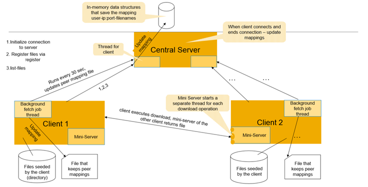

# Peer-to-peer file exchange :busts_in_silhouette:

Implement a simplified peer-to-eer system for file transfer, which uses a central server to find users and data.

## Task

The system is of two parts.
1. Server, which persists metadata about the available files.
2. Clients, which fetch files from other clients - the clients fetch info from the server about where from (which client) a concrete file can be found.

The system provides the feature to download files from different users.

Each user may download a file from every other. There's a central server, whom persists data about the users and the files that can be downloaded from
them (Files are never downloaded and persisted on the central server).

The server can work with multiple clients concurrently.

The server persists data about the active users in-memory (choose a proper data structure) - names, addresses, ports (p2p exchange requires that
the addresses of peers to be known); files, which may be fetched from them (absolute path). This information is refreshed when a client reigsters
files for download (the command "register" further down) and when a client closes its' connection with the server.

Clients can connect with each other (peer-to-peer communication). Each must initiate a "mini server" within himself. This mini-server should
be able to process the command download, described further down. You can choose if the mini-server should process only one download request or
multiple in parallel (if one - while prcoessing, the other download requests must await).

The client also persists the following <*username* - *user* *IP:port*>.
Example:
```
Pesho123 – 127.0.0.1:1234
Gosho321 – 127.0.0.1:2314
```
To gather this information, the client must regularly (every 30 seconds) ask the server about the registered users and their addresses. The data is
saved in a file in the described format beforehand.

### Client

The client executes the following commands:
1. `register <user> <file1, file2, file3, …., fileN>` - allows clients to "declare" their files as available for download. Through the parameter "username",
   the client could set a unique name (the name with which the central server will associate the corresponding IP address).
2. `unregister <user> <file1, file2, file3, …., fileN>` - the user declares that its' files <file1, file2, file3, ..., fileN> can no longer be downloaded.
   ***Note***: For the sake of simplicity, we are not interested in the security aspects of the solution, e.g it's not required to implement
   an authentication that will guarantee that a certain user can register only de-register only files that he himself has registered.
3. `list-files` – Returns the files that are available for download and the users from which they can be fetched.
4. `download <user> <path to file on user> <path to save>` - Downloads a file from the prvoided user.

### Server

The server processes the following commands:
1. When processing `register <user> <file1, file2, file3, …., fileN>`, the server refreshes the data about the provided user (Adds the files as available
   for download).
2. When processing `unregister <user> <file1, file2, file3, …., fileN>`, updates the matadata for the provided user (the following files are
   no longer available for download from this user).
3. When processing `list-files`, returns the registered files on the server with the following format: `<user> : <path to file>`
4. When executing `download <user> <path to file on user> <path to save>`, no communication with the central server happens.

   **a.** The client decides the *IP Address* and *port* of the user, from which the file can be fetched (provided by the local mapping).

   **b.** The client sends the command to the mini-server of the user, described in step (a).

   **c.** The mini-server sends out the file.

   **d.** After the user has received the file, he automatically initiates the command `<user> <path to saved file>`. This way the information
   in the central server about the users, that persist this file, is refreshed.

Tip **Diagram**:



## Error messages

Upon incorrect usage of the application, the user has to be provided with the appropriate error messages.

For program errors there should be an appropriate user-friendly message. Technical information about the erorr and stacktraces are saved
in a file on the file system - there's no concrete format for the error log.

For example, it's irrelevant to the user when there's a communication error, for him to receive "IO Exception occured: connection reset". It's much
more appropriate if it were "Unable to connect to the server. Try again later or contact administrator by providing the logs in
Например, нерелевантно е при команда на потребител и възникнал проблем с мрежовата комуникация, да се изписва грешка от вида на "IO exception occurred: connection reset", по-подходящо би било "Unable to connect to the server. Try again later or contact administrator by providing the logs in `<path_to_logs_file>`.

For unexpected errors on the server, there should be an appropriate message in the console or in a error log file. The log should contain
descriptive information, such as the user for which the error has ocured, stacktraces, etc...обще е обвързана с потребителско взаимодействие) и stacktraces.

Good luck!
